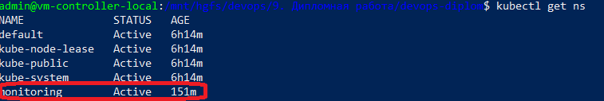

# ДИПЛОМНАЯ РАБОТА ПО КУРСУ "DEVOPS-ИНЖЕНЕР"

## 1. Описание стенда

### Схема стенда

Стенд представляет собой отказоустойчивый (High Availability) Kubernetes-кластер, состоящий из 3 мастеров и 4-х рабочих узлов. Все узлы создаются в Яндекс.Облаке.


#### _Особенности стенда_

1. Для обеспечения отказоустойчивости используются все доступные зоны Яндекс.Облака (`"ru-central1-a", "ru-central1-b", "ru-central1-c"`).

2. В каждой зоне присутствует по 1-му мастеру. БД `etcd` развернута только на мастерах. На них стоит запрет на планирование и выполнение задач (`no-schedule`).

3. Предполагается, что наибольшая нагрузка по трафику будет в зоне `"ru-central1-a"`, поэтому в ней 2 рабочих узла, в остальных по 1-му рабочему узлу.

4. Для обеспечения доступности кластера предусмотрен сетевой балансировщик от Яндекс.Облака (NLB), который перенаправляет запросы с внешнего IP-адреса, порт `8888`, на один из мастер-серверов на внутренний порт `6443`. Алгоритм ротации - `round-robin` + проверка на доступность (`keepalive` по порту `6443`).

5. Для доступа к приложениям извне, предусмотрен балансировщик уровня приложения от Яндекс.Облака (ALB), который перенаправляет запросы с внешнего IP-адреса на диапазон портов, на группу серверов (мастера) и определенный HTTP-порт.

6. Предусмотрен механизм `keepalive` для мастеров. Для этого на них установлен nginx, выдающий статическую страницу по пути `/` и порту `8080`.

### Компоненты стенда

__Схема сети от Яндекса__


## 2. Подготовка инфраструктуры terraform

1. Создание каталога в Яндекс.Облаке (значение `folder_id`)

2. Добавление прав доступа к каталогу для существующего сервисного аккаунта с правами: `compute.editor`, `editor`, `iam.admin`, `kms.admin`, `kms.keys.encrypterDecrypter`, `resource-manager.admin`, `storage.admin`, `load-balancer.admin`.

3. Запуск предварительной настройки terraform от имени указанного сервисного аккаунта

    1. Создать файл `secret.auto.tfvars` и добавить значение переменных `token`, `cloud_id`, `folder_id` ([terraform-init/variables.tf](terraform-init/variables.tf#L5))

    2. _(при необходимости)_ Изменить значения переменных в файле [terraform-init/variables.auto.tfvars](terraform-init/variables.auto.tfvars)

    3. Выполнить команду запуска

      ```
        terraform -chdir=./terraform-init apply -var-file=../secret.auto.tfvars

      ```

4. Получение файла с ключами от созданного в п.3 сервисного аккаунта

    ```
    yc iam key create --output terraform-main/sa_key.json --service-account-name=terraform-sa --folder-id=<folder-id>
    ```

5. Инициализация основного проекта terraform (добавление учетных данных созданного сервисного аккаунт, и настройка хранения файла состояния .tfstate в объектном хранилище Яндекс Облака)

    ```
    terraform -chdir=./terraform-main init -backend-config=backend.secret.tfvars -reconfigure
    ```

6. Запуск создания основной инфраструктуры

    ```
    terraform -chdir=./terraform-main apply -var-file=../secret.auto.tfvars
    ```

    _Установка кластера занимает ~25 минут._

7. Изменение конфигурационного файла кластера по пути `~/.kube/config` - файл создаётся автоматически

    ```
    nano ~/.kube/config
    ```

    В файле необходимо заменить IP-адрес подключения на внешний IP-адрес балансировщика нагрузки и порт подключения на внешний порт. информация отображается в выходных данных terraform-main

    ```
    nlb = {
      "address" = "<external-control-IP>"
      "ext_port" = 8888
      "name" = "kube-nlb-ext"
      "target_port" = 6443
    }
    ```

8. Проверка работы кластера

    ```
    kubectl get nodes
    ```

    _Ожидаемый результат:_

    

9. Проверка корректности работы балансировщика - обращение по внешнему IP-адресу по пути `/` на порт `8080` несколько раз. IP=адрес доступен в выходных данных terraform-main

    ```
    alb = {
      "address" = "<external-app-IP>"
      "name" = "kube-alb"
      "ports" = tolist([
      80,
      9000,
      9001,
      10000,
      8080,
      ])
    }
    ```

    _Ожидаемый результат:_ изменение содержимого html-страницы

    

__Результат:__

1. Созданная инфраструктура отказоустойчивого кластера Kubernetes с внешними балансировщиками нагрузки для управления и для приложений.

2. Настроенный конфигурационный файл для управления кластером с помощью команды `kubectl`.

3. Внешний IP-адрес для взаимодействия с приложениями, запущенными внутри кластера (`<external-app-IP>`).

## 2. Установка Prometheus, Grafana, Node Exporter

Для установки Prometheus, Grafana, AlertManager используется helm-сборка `kube-prometheus-stack`. Установка осуществляется в отдельном terraform-проекте [terraform-apps](terraform-apps/main.tf) с использованием провайдера `helm` ([terraform-apps/providers.tf](terraform-apps/providers.tf)).

Конфигурационный файл - [terraform-apps/prometheus-stack/values/prometheus.yaml](terraform-apps/prometheus-stack/values/prometheus.yaml).

Для запуска проекта необходимо выполнить команды:

```
terraform -chdir=./terraform-apps init
terraform -chdir=./terraform-apps apply -var-file=../secret.auto.tfvars
```

__Результат:__

Созданное пространство имен `namespace`, в котором развернуты поды и службы Prometheus.



Созданные контейнеры, службы, приложения


По выделенному порту (`30238`) доступен web-интерфейс Grafana. В балансировщике нагрузки ([terraform-main/app-load-balancer](terraform-main/app-load-balancer/main.tf)) создано правило перенаправления HTTP-трафика с порта 80 на порт `30238` (переменная `app_balancer_ports` в файле [terraform-main/variables.auto.tfvars](terraform-main/variables.auto.tfvars#L59)).

Таким образом, Grafana доступна по `<external-app-IP>` и порту `80`.


## 3. Настройка CI/CD terraform-проекта

Для настройки CI/CD была подготовлена виртуальная машина с установленным Gitlab, куда был импортирован текущий проект из github.

### Настройка pipeline

1. Импорт проекта из github.

2. Создание и заполнение файла [.gitlab-ci.yml](.gitlab-ci.yml)

    - описание этапов обработки: `validate`, `plan`, `apply`, `destroy`

    - описание обработчиков каждого этапа с вызовом команды `terraform ...`

3. Добавление необходимых переменных, содержащих ключевую и парольную информацию, а также переменные из [secret.auto.tfvars](secret.auto.tfvars)

    Файл `sa_key.json` предварительно был закодирован base64 и скопирован в переменную `$YC_KEY`.

    Требуется дописать вручную переменные `bucket`, `region`, `key` в файле [terraform-main/backend.tf](terraform-main/backend.tf).

    

4. Установка `gitlab-runner` вместе с `terraform` на отдельной ВМ `vm-control-1` и регистрация раннера типа `shell`.

5. Изменение кода проекта и анализ проработки pipeline

    

    - этап `validate`

      

    - этап `plan`

      

    - этап `apply`

      

## Тестовое приложение

## CI/CD тестового приложения

------

## Полезные дополнительные материалы, которые пригодились для выполнения задания

[Установка kubernetes через kubespray - habr](https://habr.com/ru/articles/426959/)

[https://dev.to/admantium/kubernetes-installation-tutorial-kubespray-46ek?ysclid=m97m4b14sh390719292](https://dev.to/admantium/kubernetes-installation-tutorial-kubespray-46ek?ysclid=m97m4b14sh390719292)

[https://developer.hashicorp.com/terraform/language/resources/provisioners/remote-exec](https://developer.hashicorp.com/terraform/language/resources/provisioners/remote-exec)

[https://habr.com/ru/articles/725640/](https://habr.com/ru/articles/725640/)

[Шифрование бакета - Yandex.Cloud](https://yandex.cloud/ru/docs/storage/operations/buckets/encrypt)

[Yandex Storage Bucket](https://terraform-provider.yandexcloud.net/resources/storage_bucket#nestedblock--lifecycle_rule--transition)

[https://fauzislami.github.io/blog/2021/10/17/highly-available-kubernetes-cluster-with-haproxy-and-keepalived/](https://fauzislami.github.io/blog/2021/10/17/highly-available-kubernetes-cluster-with-haproxy-and-keepalived/)

[https://fauzislami.github.io/blog/2021/10/17/highly-available-kubernetes-cluster-with-haproxy-and-keepalived/](https://fauzislami.github.io/blog/2021/10/17/highly-available-kubernetes-cluster-with-haproxy-and-keepalived/)

[Atlantis](https://docs.vultr.com/run-terraform-in-automation-with-atlantis)

------

# Задание

[https://github.com/netology-code/devops-diplom-yandexcloud](https://github.com/netology-code/devops-diplom-yandexcloud)
